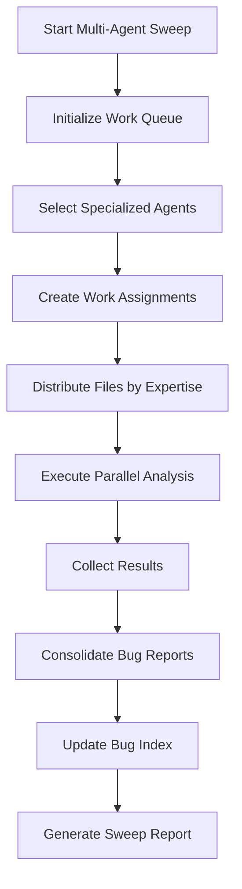

# Multi-Agent Bug Detection Workflow

**Version**: 1.0.0  
**Last Updated**: June 23, 2025  
**Target Audience**: Teams, comprehensive sweeps, coordinated analysis

## Overview

The multi-agent workflow provides coordinated bug detection using multiple specialized agents working in parallel. This approach is designed for:
- **Comprehensive codebase analysis** with specialized expertise
- **Team coordination** with 6 agents working simultaneously
- **Efficient token usage** through intelligent work distribution
- **Expert-level analysis** from specialized agent perspectives
- **Large-scale sweeps** covering entire projects quickly

Each agent brings specialized knowledge and focuses on their area of expertise while the coordination system prevents duplicate work and ensures comprehensive coverage.

---

## Agent Specialization System

### Core Agent Types

#### 1. 🔐 Authentication Specialist
- **Primary Focus**: Auth flows, wallet integration, session management
- **Expertise Areas**:
  - Authentication & Auth Flow
  - Security vulnerabilities
  - Web3 Integration
- **Specializes in detecting**:
  - Authentication loops and infinite redirects
  - Wallet connection issues
  - Session management problems
  - Token handling vulnerabilities
  - Permission and access control flaws

#### 2. 🏆 Competition Specialist
- **Primary Focus**: Competition system, judging, scoring
- **Expertise Areas**:
  - Competition System
  - API/Backend (competition-related)
  - Notifications (competition-related)
- **Specializes in detecting**:
  - Scoring calculation errors
  - Judge assignment problems
  - Entry submission failures
  - Leaderboard inconsistencies
  - Competition state management issues

#### 3. 📱 Mobile & UI Specialist
- **Primary Focus**: Mobile responsiveness, user interface
- **Expertise Areas**:
  - Mobile Interface
  - UI/Navigation
  - Performance (UI-related)
- **Specializes in detecting**:
  - Responsive design issues
  - Mobile-specific bugs
  - Touch interaction problems
  - Navigation failures
  - UI component inconsistencies

#### 4. ⚡ Performance Specialist
- **Primary Focus**: Speed, optimization, efficiency
- **Expertise Areas**:
  - Performance optimization
  - API/Backend (performance)
  - Genetic Mapping (performance)
- **Specializes in detecting**:
  - Memory leaks
  - Inefficient algorithms
  - Unnecessary re-renders
  - Large bundle sizes
  - Slow database queries

#### 5. 🛡️ Security Specialist
- **Primary Focus**: Vulnerabilities, data protection
- **Expertise Areas**:
  - Security vulnerabilities
  - Authentication & Auth Flow (security aspects)
  - API/Backend (security)
- **Specializes in detecting**:
  - XSS vulnerabilities
  - Injection flaws
  - Insecure data handling
  - Permission bypasses
  - Crypto implementation issues

#### 6. 🔧 Integration Specialist
- **Primary Focus**: System integration, data flow
- **Expertise Areas**:
  - API/Backend
  - Web3 Integration
  - Inventory Management
  - Marketplace
- **Specializes in detecting**:
  - API integration failures
  - Data consistency issues
  - External service problems
  - Blockchain interaction bugs
  - Database transaction issues

---

## When to Use Multi-Agent Mode

### ✅ Ideal Scenarios

**Comprehensive Analysis**
- Full codebase sweeps before major releases
- Weekly or monthly comprehensive bug detection
- After significant architecture changes
- Before important competitions or events

**Team Coordination**
- When multiple team members can work simultaneously
- Distributed bug detection across expertise areas
- Parallel analysis of different system components
- Coordinated preparation for launches

**Specialized Expertise Needed**
- Complex systems requiring expert knowledge
- Security audits and vulnerability assessments
- Performance optimization initiatives
- Multi-component integration testing

**Large-Scale Projects**
- Projects with 200+ files to analyze
- Complex codebases with multiple domains
- Time-critical comprehensive sweeps
- Efficiency through parallelization

### ❌ When to Use Single-Agent Instead

- Small, focused changes or individual development
- Quick pre-commit checks
- Learning the bug detection patterns
- Simple component-specific analysis

---

## Quick Start Guide

### Prerequisites

```bash
# Ensure you're in the project root
cd /path/to/your/project

# Verify bug tracking system exists
ls docs/bugs/BUG_INDEX.md

# Ensure sufficient system resources for 6 agents
# Recommended: 8GB+ RAM, 4+ CPU cores
```

### Basic Multi-Agent Sweep

```typescript
import { bugCoordinator } from '@/utils/bugCoordinator';

// Run comprehensive multi-agent sweep
const sweepId = await bugCoordinator.startBugSweep({
  mode: 'multi',
  agentCount: 6, // Use all 6 specialized agents
  priority: 'all' // Detect all severity levels
});

// Monitor progress
const progress = bugCoordinator.getSweepProgress(sweepId);
console.log(`Multi-agent progress: ${progress?.completedFiles}/${progress?.totalFiles} files`);
console.log(`Active agents: ${progress?.agentsActive}`);
console.log(`Bugs found: ${progress?.bugsFound}`);
```

### Quick Setup Script

Create `scripts/bug-sweep-multi.js`:

```javascript
#!/usr/bin/env node

const { bugCoordinator } = require('../utils/bugCoordinator');

async function runMultiAgentSweep() {
  const args = process.argv.slice(2);
  const agentCount = parseInt(args[0]) || 6;
  const priority = args[1] || 'all';
  const components = args.slice(2);

  console.log(`🚀 Starting ${agentCount}-agent bug sweep...`);
  
  const config = {
    mode: 'multi',
    agentCount,
    priority: priority === 'all' ? 'all' : priority,
    targetComponents: components.length > 0 ? components : undefined,
    timeoutMinutes: 30
  };

  try {
    const sweepId = await bugCoordinator.startBugSweep(config);
    
    // Monitor progress with detailed agent info
    const monitorProgress = () => {
      const progress = bugCoordinator.getSweepProgress(sweepId);
      const agents = bugCoordinator.getAgentStatus();
      
      if (progress) {
        console.log(`
📊 Multi-Agent Sweep Status
════════════════════════════
Status: ${progress.status}
Files: ${progress.completedFiles}/${progress.totalFiles} (${Math.round((progress.completedFiles/progress.totalFiles)*100)}%)
Bugs Found: ${progress.bugsFound}
Active Agents: ${progress.agentsActive}
Errors: ${progress.errors.length}

👥 Agent Status:
${agents.filter(a => a.status === 'available').map(a => 
  `   ✅ ${a.name} (${a.expertise.slice(0,2).join(', ')})`
).join('\n')}
        `);
        
        if (progress.status === 'completed') {
          console.log('✅ Multi-agent sweep completed!');
          console.log(bugCoordinator.generateSweepReport(sweepId));
          process.exit(0);
        } else if (progress.status === 'failed') {
          console.log('❌ Sweep failed:', progress.errors);
          process.exit(1);
        } else {
          setTimeout(monitorProgress, 3000);
        }
      }
    };
    
    monitorProgress();
  } catch (error) {
    console.error('❌ Multi-agent sweep failed:', error);
    process.exit(1);
  }
}

runMultiAgentSweep();
```

Usage Examples:
```bash
# Full 6-agent comprehensive sweep
node scripts/bug-sweep-multi.js 6 all

# 4 agents focusing on high priority issues
node scripts/bug-sweep-multi.js 4 high

# 3 agents for specific components
node scripts/bug-sweep-multi.js 3 medium "Authentication & Auth Flow" "Competition System"

# Security-focused sweep
node scripts/bug-sweep-multi.js 2 critical "Security" "Authentication & Auth Flow"
```

---

## Detailed Configuration

### Agent Selection Strategies

#### Automatic Selection
```typescript
const config = {
  mode: 'multi',
  agentCount: 6, // System selects best 6 agents
  priority: 'high'
};
```

#### Component-Based Selection
```typescript
const config = {
  mode: 'multi',
  targetComponents: [
    'Authentication & Auth Flow',
    'Competition System',
    'Security'
  ]
  // Automatically selects agents with relevant expertise
};
```

#### Custom Agent Configuration
```typescript
// Add custom specialized agent
bugCoordinator.addAgent({
  id: 'crypto-specialist',
  name: 'Cryptocurrency Integration Specialist',
  expertise: ['Web3 Integration', 'Security', 'API/Backend'],
  maxConcurrentFiles: 5,
  tokensPerHour: 8000,
  priority: 'high',
  status: 'available'
});

const config = {
  mode: 'multi',
  agentCount: 7 // Now includes our custom agent
};
```

### Advanced Configuration Options

#### Resource Management
```typescript
const config = {
  mode: 'multi',
  agentCount: 4,
  maxTokensPerAgent: 15000, // Limit per agent
  timeoutMinutes: 45, // Extended timeout for complex analysis
  priority: 'all'
};
```

#### Targeted Analysis
```typescript
const config = {
  mode: 'multi',
  targetComponents: [
    'Competition System',
    'Mobile Interface'
  ],
  priority: 'high',
  // Only agents with these expertise areas will be selected
};
```

#### Performance Optimization
```typescript
const config = {
  mode: 'multi',
  agentCount: 3, // Fewer agents for smaller systems
  maxTokensPerAgent: 10000, // Conservative token usage
  timeoutMinutes: 20 // Faster completion
};
```

---

## Work Distribution & Coordination

### Intelligent File Assignment

The coordinator distributes work based on:

1. **Agent Expertise Matching**
   ```typescript
   // Authentication Specialist gets:
   - utils/clientAuth.ts
   - hooks/useAuth.ts
   - app/api/auth/route.ts
   - components/WalletConnector.tsx
   
   // Competition Specialist gets:
   - app/api/competitions/route.ts
   - components/CompetitionEntry.tsx
   - hooks/useCompetition.ts
   - utils/scoringCalculations.ts
   ```

2. **File Priority Weighting**
   - **High Priority**: API routes, authentication, critical components
   - **Medium Priority**: Business logic, components, hooks
   - **Low Priority**: Utilities, types, configuration

3. **Load Balancing**
   - Each agent gets similar token budget
   - Work distributed evenly across available agents
   - Dynamic adjustment based on agent capabilities

4. **Conflict Prevention**
   - File locking prevents duplicate analysis
   - Atomic work assignments
   - Progress tracking per agent

### Agent Coordination Flow



### Progress Monitoring

```typescript
// Real-time agent monitoring
const monitorAgents = () => {
  const agents = bugCoordinator.getAgentStatus();
  const progress = bugCoordinator.getSweepProgress(sweepId);
  
  console.log(`
🔍 Agent Work Distribution:
${agents.map(agent => `
  ${agent.name}:
    Status: ${agent.status}
    Files: ${agent.currentWork?.length || 0}
    Expertise: ${agent.expertise.slice(0, 2).join(', ')}
`).join('')}
  
📈 Overall Progress:
  Completed: ${progress?.completedFiles}/${progress?.totalFiles}
  Bugs Found: ${progress?.bugsFound}
  Estimated Completion: ${progress?.estimatedCompletion}
  `);
};
```

---

## Agent Expertise Deep Dive

### Authentication Specialist Patterns

**Detection Focus:**
```typescript
// Infinite auth loops
useEffect(() => {
  if (!user.isAuthenticated) {
    authenticate(); // Potential loop if authenticate modifies user
  }
}, [user]);

// Wallet connection issues
const connectWallet = async () => {
  const result = await wallet.connect();
  // Missing error handling for connection failures
};

// Session management problems
localStorage.setItem('user', JSON.stringify(user)); // Insecure storage
```

**Specialized Analysis:**
- Wallet signature verification flows
- Token refresh mechanisms
- Cross-site request forgery protection
- Authentication state persistence

### Competition Specialist Patterns

**Detection Focus:**
```typescript
// Scoring calculation errors
const calculateScore = (entries) => {
  return entries.reduce((total, entry) => total + entry.score, 0) / entries.length;
  // Division by zero if no entries
};

// Judge assignment logic
const assignJudge = (competition, judge) => {
  competition.judges.push(judge);
  // No validation of judge qualifications or conflicts
};

// Entry submission validation
const submitEntry = async (entry) => {
  await fetch('/api/entries', { 
    method: 'POST', 
    body: JSON.stringify(entry) 
  });
  // No error handling or validation
};
```

**Specialized Analysis:**
- Competition state transitions
- Judge invitation and verification
- Entry submission workflows
- Leaderboard calculation accuracy

### Security Specialist Patterns

**Detection Focus:**
```typescript
// XSS vulnerabilities
const displayUserContent = (content) => {
  return <div dangerouslySetInnerHTML={{__html: content}} />; // Dangerous
};

// SQL injection risks
const getUserData = (userId) => {
  return db.query(`SELECT * FROM users WHERE id = ${userId}`); // Vulnerable
};

// Insecure cryptographic practices
const hashPassword = (password) => {
  return md5(password); // Weak hashing
};
```

**Specialized Analysis:**
- Input validation and sanitization
- Authentication bypass vulnerabilities
- Data exposure risks
- Cryptographic implementation flaws

---

## Performance Optimization

### Resource Management

**System Requirements:**
- **Minimum**: 4GB RAM, 2 CPU cores
- **Recommended**: 8GB+ RAM, 4+ CPU cores
- **Optimal**: 16GB+ RAM, 8+ CPU cores

**Token Budget Management:**
```typescript
const calculateOptimalAgentCount = (totalFiles, availableTokens) => {
  const tokensPerFile = 200; // Average estimate
  const totalTokensNeeded = totalFiles * tokensPerFile;
  const maxAgents = Math.floor(availableTokens / 10000); // 10k tokens per agent
  
  return Math.min(6, maxAgents, Math.ceil(totalFiles / 50));
};
```

**Performance Monitoring:**
```typescript
const performanceMetrics = {
  filesPerMinute: progress.completedFiles / ((Date.now() - progress.startTime) / 60000),
  bugsPerFile: progress.bugsFound / progress.completedFiles,
  agentEfficiency: progress.completedFiles / progress.agentsActive,
  tokensPerBug: estimatedTokensUsed / progress.bugsFound
};
```

### Scaling Strategies

**For Large Codebases (500+ files):**
```typescript
const largeProjectConfig = {
  mode: 'multi',
  agentCount: 6,
  maxTokensPerAgent: 20000,
  timeoutMinutes: 60,
  priority: 'high' // Focus on important issues first
};
```

**For Resource-Constrained Environments:**
```typescript
const lightweightConfig = {
  mode: 'multi',
  agentCount: 3,
  maxTokensPerAgent: 8000,
  timeoutMinutes: 30,
  targetComponents: ['Security', 'Authentication & Auth Flow'] // Focused sweep
};
```

**For Time-Critical Sweeps:**
```typescript
const rapidConfig = {
  mode: 'multi',
  agentCount: 6,
  priority: 'critical', // Only critical issues
  timeoutMinutes: 15,
  maxTokensPerAgent: 12000
};
```

---

## Advanced Workflows

### Pre-Release Comprehensive Sweep

```typescript
async function preReleaseSweep() {
  console.log('🚀 Starting pre-release comprehensive sweep...');
  
  // Phase 1: Security-focused sweep
  const securitySweepId = await bugCoordinator.startBugSweep({
    mode: 'multi',
    agentCount: 3,
    priority: 'critical',
    targetComponents: ['Security', 'Authentication & Auth Flow', 'API/Backend']
  });
  
  await waitForCompletion(securitySweepId);
  
  // Phase 2: Comprehensive sweep
  const fullSweepId = await bugCoordinator.startBugSweep({
    mode: 'multi',
    agentCount: 6,
    priority: 'all'
  });
  
  await waitForCompletion(fullSweepId);
  
  // Generate combined report
  const reports = [securitySweepId, fullSweepId]
    .map(id => bugCoordinator.generateSweepReport(id))
    .join('\n\n---\n\n');
    
  console.log('📊 Pre-release sweep completed:', reports);
}
```

### Component-Specific Team Sweeps

```typescript
async function componentTeamSweep() {
  const sweeps = [
    {
      name: 'Authentication Team',
      config: {
        mode: 'multi',
        agentCount: 2,
        targetComponents: ['Authentication & Auth Flow', 'Security', 'Web3 Integration']
      }
    },
    {
      name: 'Competition Team',
      config: {
        mode: 'multi',
        agentCount: 2,
        targetComponents: ['Competition System', 'API/Backend', 'Notifications']
      }
    },
    {
      name: 'Mobile Team',
      config: {
        mode: 'multi',
        agentCount: 2,
        targetComponents: ['Mobile Interface', 'UI/Navigation', 'Performance']
      }
    }
  ];
  
  const sweepPromises = sweeps.map(async (sweep) => {
    console.log(`🏃 Starting ${sweep.name} sweep...`);
    const sweepId = await bugCoordinator.startBugSweep(sweep.config);
    return { name: sweep.name, sweepId };
  });
  
  const results = await Promise.all(sweepPromises);
  
  results.forEach(result => {
    const report = bugCoordinator.generateSweepReport(result.sweepId);
    console.log(`📋 ${result.name} Results:`, report);
  });
}
```

### Continuous Integration Sweep

```yaml
# .github/workflows/multi-agent-bug-sweep.yml
name: Multi-Agent Bug Sweep

on:
  schedule:
    - cron: '0 2 * * 1' # Weekly on Monday 2 AM
  workflow_dispatch:

jobs:
  comprehensive-sweep:
    runs-on: ubuntu-latest
    steps:
      - uses: actions/checkout@v3
      - uses: actions/setup-node@v3
        with:
          node-version: '18'
      
      - run: npm install
      
      - name: Run multi-agent sweep
        run: |
          node scripts/bug-sweep-multi.js 6 high
          
      - name: Check for critical bugs
        run: |
          CRITICAL_COUNT=$(grep -c "🔴.*Critical.*Open" docs/bugs/BUG_INDEX.md || echo "0")
          HIGH_COUNT=$(grep -c "🟠.*High.*Open" docs/bugs/BUG_INDEX.md || echo "0")
          
          echo "Critical bugs: $CRITICAL_COUNT"
          echo "High priority bugs: $HIGH_COUNT"
          
          if [ "$CRITICAL_COUNT" -gt "0" ]; then
            echo "❌ Critical bugs detected! Immediate attention required."
            exit 1
          fi
          
          if [ "$HIGH_COUNT" -gt "10" ]; then
            echo "⚠️ Too many high priority bugs! Review needed."
            exit 1
          fi
          
      - name: Create issue if bugs found
        if: failure()
        uses: actions/github-script@v6
        with:
          script: |
            github.rest.issues.create({
              owner: context.repo.owner,
              repo: context.repo.repo,
              title: 'Multi-Agent Bug Sweep: Critical Issues Detected',
              body: 'The weekly multi-agent bug sweep has detected critical issues that require immediate attention. Please review docs/bugs/BUG_INDEX.md for details.',
              labels: ['bug', 'critical', 'automated-detection']
            });
```

---

## Troubleshooting

### Common Issues

**1. Agent Coordination Failures**
```
Symptom: Agents working on same files
Cause: File locking mechanism failure
Solution: Restart sweep, check for concurrent access
```

**2. Memory Issues with Large Sweeps**
```
Symptom: Out of memory errors
Cause: Too many agents or large token budgets
Solution: Reduce agentCount to 3-4, lower maxTokensPerAgent
```

**3. Agent Specialization Mismatch**
```
Symptom: Wrong agent analyzing irrelevant files
Cause: Component targeting logic issues
Solution: Review targetComponents configuration
```

**4. Slow Performance**
```
Symptom: Sweep takes very long time
Cause: Resource constraints or large codebase
Solution: Use priority filtering, increase timeout
```

### Performance Tuning

**Memory Optimization:**
```typescript
const memoryOptimizedConfig = {
  mode: 'multi',
  agentCount: 3, // Fewer agents
  maxTokensPerAgent: 8000, // Smaller token budget
  priority: 'high', // Focus on important issues
  timeoutMinutes: 20
};
```

**Speed Optimization:**
```typescript
const speedOptimizedConfig = {
  mode: 'multi',
  agentCount: 6, // More parallelization
  maxTokensPerAgent: 15000,
  priority: 'critical', // Only critical issues
  timeoutMinutes: 15 // Shorter timeout
};
```

**Quality Optimization:**
```typescript
const qualityOptimizedConfig = {
  mode: 'multi',
  agentCount: 6,
  maxTokensPerAgent: 25000, // More thorough analysis
  priority: 'all',
  timeoutMinutes: 60 // Extended time for quality
};
```

---

## Integration with Team Workflows

### Daily Standup Integration

```typescript
// Generate daily bug status for standup
async function generateStandupReport() {
  const sweepHistory = bugCoordinator.getSweepHistory();
  const recentSweeps = sweepHistory.filter(sweep => 
    new Date(sweep.startTime) > new Date(Date.now() - 24 * 60 * 60 * 1000)
  );
  
  const report = `
📊 Daily Bug Detection Report
═══════════════════════════
Recent Sweeps: ${recentSweeps.length}
New Bugs Found: ${recentSweeps.reduce((total, sweep) => total + sweep.bugsFound, 0)}
Critical Issues: ${getCriticalBugCount()}
High Priority: ${getHighPriorityBugCount()}

🎯 Today's Focus:
${getTopPriorityBugs().map(bug => `- ${bug.title}`).join('\n')}
  `;
  
  return report;
}
```

### Sprint Planning Integration

```typescript
// Generate comprehensive report for sprint planning
async function generateSprintPlanningReport() {
  const comprehensiveSweepId = await bugCoordinator.startBugSweep({
    mode: 'multi',
    agentCount: 6,
    priority: 'all',
    timeoutMinutes: 45
  });
  
  // Wait for completion and generate insights
  const report = bugCoordinator.generateSweepReport(comprehensiveSweepId);
  const componentBreakdown = analyzeComponentBugs();
  const effortEstimates = calculateEffortEstimates();
  
  return {
    sweepReport: report,
    componentBreakdown,
    effortEstimates,
    recommendations: generateSprintRecommendations()
  };
}
```

### Release Readiness Assessment

```typescript
async function assessReleaseReadiness() {
  const releaseReadinessSweep = await bugCoordinator.startBugSweep({
    mode: 'multi',
    agentCount: 6,
    priority: 'all',
    targetComponents: [
      'Security',
      'Authentication & Auth Flow',
      'Competition System',
      'API/Backend'
    ]
  });
  
  const progress = bugCoordinator.getSweepProgress(releaseReadinessSweep);
  const criticalBugs = getCriticalBugCount();
  const highPriorityBugs = getHighPriorityBugCount();
  
  const readinessScore = calculateReadinessScore(criticalBugs, highPriorityBugs);
  
  return {
    ready: readinessScore > 0.8,
    score: readinessScore,
    blockers: criticalBugs,
    concerns: highPriorityBugs,
    recommendations: generateReleaseRecommendations(readinessScore)
  };
}
```

---

## Best Practices

### When to Run Multi-Agent Sweeps

**Weekly Comprehensive Sweeps**
- Every Monday morning for team planning
- Full codebase analysis with all 6 agents
- All priority levels to catch everything

**Pre-Release Sweeps**
- Before major version releases
- Security-focused first, then comprehensive
- Extended timeout for thorough analysis

**Post-Merge Sweeps**
- After significant feature merges
- Targeted components affected by changes
- High priority focus for rapid feedback

**Emergency Sweeps**
- After security incidents
- Security and authentication specialists only
- Critical priority with rapid turnaround

### Team Coordination

**Clear Ownership**
- Assign bug categories to specific team members
- Authentication bugs → Auth team
- Competition bugs → Competition team
- Mobile bugs → Frontend team

**Regular Review Cycles**
- Daily: Critical and high priority bugs
- Weekly: All new bugs from sweeps
- Monthly: Comprehensive bug trend analysis

**Communication Protocols**
- Slack/Teams notifications for critical bugs
- Email summaries for weekly sweeps
- Dashboard updates for ongoing progress

---

## Output Examples

### Multi-Agent Console Output

```
🚀 Starting 6-agent bug sweep with 6 agents
👥 Agents: Authentication Specialist, Competition Specialist, Mobile & UI Specialist, Performance Specialist, Security Specialist, Integration Specialist

⚡ Executing work across 6 agents...
🔍 Agent auth-specialist analyzing 23 segments...
🔍 Agent competition-specialist analyzing 19 segments...
🔍 Agent mobile-specialist analyzing 31 segments...
🔍 Agent performance-specialist analyzing 15 segments...
🔍 Agent security-specialist analyzing 12 segments...
🔍 Agent integration-specialist analyzing 28 segments...

📊 Progress: 25/128 files processed
📊 Progress: 50/128 files processed
📊 Progress: 75/128 files processed
📊 Progress: 100/128 files processed

✅ Agent auth-specialist completed: 8 bugs found
✅ Agent competition-specialist completed: 12 bugs found
✅ Agent mobile-specialist completed: 15 bugs found
✅ Agent performance-specialist completed: 6 bugs found
✅ Agent security-specialist completed: 3 bugs found
✅ Agent integration-specialist completed: 9 bugs found

📝 Creating bug reports for 53 issues...
✅ Created BUG-010: Authentication Loop in utils/clientAuth.ts
✅ Created BUG-011: Competition Scoring Error in utils/scoring.ts
✅ Created BUG-012: Mobile Navigation Issue in components/MobileNav.tsx
...

✨ Multi-agent sweep completed: 53 bugs found and reported
```

### Comprehensive Sweep Report

```markdown
# Multi-Agent Sweep Report: sweep-1703441234567-abc123

**Status**: completed
**Duration**: 18 minutes
**Files Processed**: 234/234
**Bugs Found**: 53
**Agents Used**: 6

## Performance Metrics
- **Files per minute**: 13
- **Bugs per file**: 0.23
- **Completion rate**: 100%

## Agent Performance
- **🔐 Authentication Specialist**: 8 bugs (Auth loops, wallet issues)
- **🏆 Competition Specialist**: 12 bugs (Scoring errors, judge flows)
- **📱 Mobile Specialist**: 15 bugs (Responsive issues, touch problems)
- **⚡ Performance Specialist**: 6 bugs (Memory leaks, slow renders)
- **🛡️ Security Specialist**: 3 bugs (XSS, validation issues)
- **🔧 Integration Specialist**: 9 bugs (API failures, data consistency)

## Bug Distribution by Severity
- **Critical**: 2 bugs (immediate attention required)
- **High**: 18 bugs (prioritize for next sprint)
- **Medium**: 25 bugs (include in regular development)
- **Low**: 8 bugs (address when time permits)

## Top Priority Issues
1. BUG-015: Security vulnerability in user input validation (Critical)
2. BUG-018: Authentication bypass in admin panel (Critical)
3. BUG-021: Competition scoring calculation error (High)
4. BUG-024: Mobile app crash on entry submission (High)

## Component Analysis
- **Authentication & Auth Flow**: 12 bugs (needs focused attention)
- **Competition System**: 15 bugs (major launch blocker)
- **Mobile Interface**: 18 bugs (optimization needed)
- **Security**: 5 bugs (critical review required)
- **Performance**: 3 bugs (monitoring recommended)

## Recommendations
1. **Immediate**: Address 2 critical security issues
2. **This Sprint**: Focus on competition system bugs (15 issues)
3. **Next Sprint**: Mobile optimization initiative (18 issues)
4. **Ongoing**: Establish security review process

## Errors
No errors encountered

*Generated on 2025-06-23T10:45:00.000Z*
```

---

## Next Steps

After completing a multi-agent sweep:

1. **Immediate Triage**
   - Review critical bugs within 1 hour
   - Assign high priority bugs to specialists
   - Create emergency fixes for blockers

2. **Team Planning**
   - Incorporate bug fixes into sprint planning
   - Assign component-specific bugs to teams
   - Estimate effort for major bug categories

3. **Continuous Improvement**
   - Analyze bug patterns for prevention
   - Update agent specializations based on findings
   - Refine detection patterns for better accuracy

4. **Follow-up Sweeps**
   - Run targeted sweeps after fixes
   - Validate resolved bugs don't regress
   - Monitor bug trends over time

For simpler analysis needs, consider the [Single-Agent Workflow](./single-agent-workflow.md).

---

*This workflow is part of the comprehensive bug management system. See [workflow-guide.md](../templates/workflow-guide.md) for integration with the overall bug tracking process.*