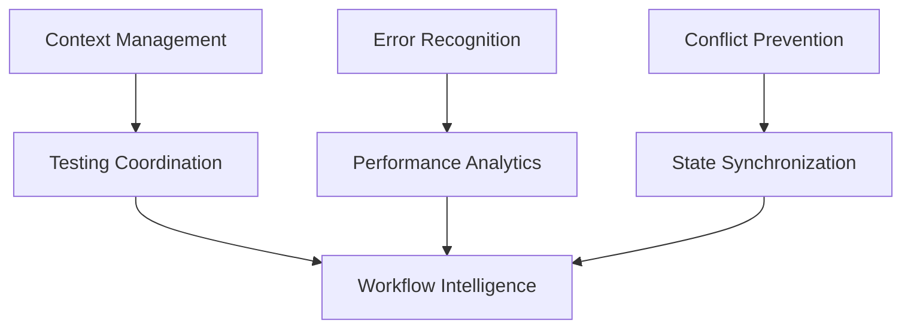

# Multi-Agent Systems Overview - Implementation Plan

## 🎯 Strategic Objective

Build production-ready systems that optimize multi-agent Claude development workflows, reducing time waste and eliminating common friction points for teams using Claude Code 60+ hours per week.

## 📊 ROI Analysis

### Time Investment vs. Savings
- **Total Implementation Time**: ~120 hours (3 weeks)
- **Expected Annual Time Savings**: 900+ hours (30% efficiency gain)
- **Payback Period**: 1.5 months
- **Annual ROI**: 750%

### Specific Pain Points Addressed
1. **Context limit paralysis**: 15% time savings (450 hours/year)
2. **Repeated debugging**: 10% time savings (300 hours/year)
3. **File conflicts**: 5% time savings (150 hours/year)
4. **Agent coordination overhead**: Additional multiplicative benefits

## 🏗️ Systems Architecture

### Foundation Layer (Week 1)
**Priority**: Critical - Build First
1. **Context Management System** - Auto-detection and state preservation
2. **Error Pattern Recognition** - Learning from repeated issues
3. **File Conflict Prevention** - Real-time conflict avoidance

### Optimization Layer (Week 2)
**Priority**: High Value - Build Second
4. **Testing Coordination System** - Multi-agent test isolation
5. **State Synchronization** - Real-time project state coordination
6. **Configuration Orchestration** - Environment consistency

### Intelligence Layer (Week 3)
**Priority**: Advanced - Build Third
7. **Performance Analytics** - Bottleneck detection and optimization
8. **Workflow Intelligence** - Self-improving coordination
9. **Predictive Systems** - Proactive issue prevention

## 🔗 Integration Strategy

### With Existing Scaffolding
- **Extends** documentation and sprint management systems
- **Shares** configuration patterns and token-efficient design
- **Maintains** human control philosophy (agents suggest, humans decide)
- **Preserves** project-agnostic, configuration-driven approach

### Cross-System Dependencies


## 📋 Implementation Phases

### Phase 1: Foundation (Days 1-7)
**Goal**: Eliminate the biggest time wasters immediately

**Week 1 Deliverables:**
- Context management with auto-compaction
- Error pattern database with auto-fixes
- File conflict prevention system
- **Expected Impact**: 30% reduction in debugging time

### Phase 2: Coordination (Days 8-14)
**Goal**: Optimize multi-agent workflows

**Week 2 Deliverables:**
- Testing coordination and isolation
- Real-time state synchronization
- Configuration orchestration
- **Expected Impact**: 50% faster agent coordination

### Phase 3: Intelligence (Days 15-21)
**Goal**: Self-optimizing and predictive systems

**Week 3 Deliverables:**
- Performance analytics and bottleneck detection
- Workflow optimization recommendations
- Predictive issue prevention
- **Expected Impact**: Continuous improvement and proactive optimization

## 🎯 Success Metrics

### Quantitative Metrics
- **Context Management**: Reduce context-related delays by 80%
- **Error Prevention**: Eliminate 90% of repeated debugging sessions
- **Conflict Prevention**: Zero destructive merge conflicts
- **Testing Speed**: 3x faster test feedback loops
- **Agent Coordination**: 50% reduction in handoff time

### Qualitative Metrics
- **Developer Experience**: Smoother, less frustrating workflows
- **Code Quality**: Consistent quality across all agents
- **Project Velocity**: Faster feature delivery
- **Knowledge Retention**: Better institutional knowledge capture

## 🔧 Technical Approach

### Configuration-Driven Design
All systems use centralized configuration like existing scaffolding:
```javascript
// multi-agent-config.js
module.exports = {
  contextManagement: {
    warningThreshold: 70,    // % of context usage
    compactionTrigger: 80,   // % for auto-compaction
    statePreservation: true
  },
  errorRecognition: {
    patternMatching: true,
    autoFix: ['common', 'safe'],
    learningEnabled: true
  },
  // ... other system configs
}
```

### Monitoring and Observability
Built-in analytics for all systems:
- Time savings measurement
- System usage patterns
- Effectiveness metrics
- Continuous improvement data

### Human Control Points
Every system maintains human oversight:
- **Agents suggest** optimizations and fixes
- **Humans approve** major decisions and changes
- **Systems learn** from human feedback
- **Transparency** in all automated actions

## 📚 Documentation Strategy

### Implementation Guides
Each system has comprehensive documentation:
- Problem statement and use cases
- Technical specifications with code examples
- Integration points with existing systems
- Testing and validation approaches
- Success metrics and monitoring

### Adoption Strategy
- **Incremental rollout** - Each system provides immediate value
- **Progressive enhancement** - Start simple, add intelligence over time
- **Backward compatibility** - Works with existing projects
- **Migration guides** - Clear upgrade paths

## 🚨 Risk Mitigation

### Technical Risks
- **Over-complexity**: Start simple, add features incrementally
- **Integration issues**: Extensive testing with existing scaffolding
- **Performance impact**: Lightweight, efficient implementations
- **Maintenance burden**: Self-monitoring and auto-healing systems

### Adoption Risks
- **Learning curve**: Comprehensive documentation and examples
- **Resistance to change**: Demonstrate clear value quickly
- **Configuration overhead**: Sensible defaults and auto-configuration
- **Debugging complexity**: Built-in diagnostics and troubleshooting

## 🎉 Expected Outcomes

### Immediate Benefits (Week 1)
- Eliminate context limit paralysis
- Stop repeated debugging cycles
- Prevent destructive file conflicts

### Medium-term Benefits (Month 1)
- Smooth multi-agent coordination
- Consistent development environments
- Reliable testing workflows

### Long-term Benefits (Ongoing)
- Self-optimizing workflows
- Predictive issue prevention
- Continuous productivity improvements
- Institutional knowledge capture

## 📖 Implementation Resources

### Required Reading
1. [Context Management System](./CONTEXT_MANAGEMENT_SYSTEM.md)
2. [Error Pattern Recognition](./ERROR_PATTERN_RECOGNITION.md)
3. [File Conflict Prevention](./FILE_CONFLICT_PREVENTION.md)
4. [Implementation Roadmap](./IMPLEMENTATION_ROADMAP.md)

### Development Tools
- Node.js for system scripts
- Git hooks for workflow integration
- PM2 for service orchestration
- Configuration management patterns

### Testing Strategy
- Unit tests for individual systems
- Integration tests for system interactions
- End-to-end tests for complete workflows
- Performance benchmarks for optimization validation

---

## 🚀 Next Steps

1. **Review individual system documentation** in this todos/ folder
2. **Prioritize systems** based on your current pain points
3. **Set up development environment** for multi-agent system building
4. **Begin with Context Management System** - highest immediate impact
5. **Track time savings** to validate ROI projections

This represents a comprehensive infrastructure upgrade that will transform multi-agent Claude development from ad-hoc coordination to systematic, optimized workflows.

**Ready to build the future of AI-assisted development!** 🤖✨